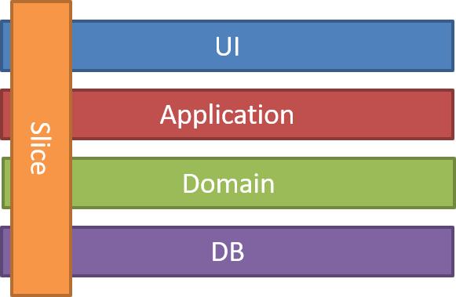

# Web Tracker

## Context

We have a website on the Internet and we would like to get some very simple indication
of how visitors navigate the pages. For that purpose, we managed to configure our
website to send an event every time a visitor navigates to a page. Our website is
capable of generating unique identifiers for visitors as a string of characters.
The system generating that event is able to talk to a REST HTTP interface and
represents each individual event as a JSON document containing two attributes: the
unique identifier of the visitor and the URL of the visited page.
Our product team is starting a new sprint. We are picking the following user story:
As a digital marketeer, I need to know how many distinct visitors navigated to a page,
knowing its URL.

## Task
Build a GoLang web service capable of:
Ingesting user navigation JSON events via a REST HTTP endpoint. Each event is
to be ingested via a separate HTTP request (i.e. no batch and no streaming
ingestion).
Serving the number of distinct visitors for any given page via another REST HTTP
endpoint. The page URL we are interested in should be a query parameter of the
HTTP request. The number of distinct visitors for that URL is returned in a JSON
object.

## Constraints
There is no need for persistence to a database. Everything can be kept in memory.
The web service must be capable of handling concurrent requests on both
endpoints.
Don't solve the data access concurrency problem using an external library

----

# Web Tracker - Plan

## 1. Problem Analysis

### Core Problem
- REST API to track web visitor events
- Serve unique visitors analytics by URL
- In-memory storage with concurrency support

### Features
- **Feature 1**: Ingest visitor events via REST endpoint
- **Feature 2**: Query unique visitors analytics via REST endpoint in JSON format

### Event Ingestion
**Endpoint**: `POST /web-tracker/new-visitor`

**Request Body:**
```json
{
  "uid": "uuid-visitor",
  "url": "https://example.com/page"
}
```

**Success Response (200):**
```json
{
  "message": "event ingested"
}
```

**Error Response (400/500):**
```json
{
  "status_code": 400,
  "message": "validation failed: invalid URL format",
  "is_error": true
}
```

### Analytics Query
**Endpoint**: `GET /web-tracker/analytics?url=https://example.com/page`

**Success Response (200):**
```json
{
  "url": "https://example.com/page",
  "unique_visitors": 1250
}
```

**Error Response (400/500):**
```json
{
  "status_code": 400,
  "message": "invalid URL format",
  "is_error": true
}
```

## 3. Technical Constraints

- HTTP Server REST
- In-memory storage
- Concurrency support
- Thread-safe structures
- No external libs on concurrency data access

## 4. Technology Stack

- **Go 1.24**: Performance + concurrency
- **gorilla/mux**: REST routing
- **air**: server hot-reload
- **Memory**: sync.Map, sync.RWMux for thread-safe storage
- **testify**: Unit testing

## 5. Architecture

### Memory Store Design

- Possible solutions:
  
  1. Map storage
  2. Bloom filters

### Project Structure: Vertical Slicing aproach



 In this case we shre the domain and infra layer across the fetures. 
```
cmd/
├── envs
├── http-server
├── main.go
internal/
├── domain/
│   ├── visitor-event.go
│   ├── visitor-analytic.go
│   └── visitor-repository.go
├── features/
│   ├── ingest-visitors-events/
│   │   └── controller.go
│   │   └── mapper.go
│   │   └── validator.go
│   │   └── command.go
│   └── get-visitors-analytics/
│       └── controller.go
│       └── mapper.go
│       └── validator.go
│       └── query.go
├── infra/
│   └── in-memory/
│       └── visitor-repository.go
Makefile
README.md 
...
```

## 6. Implementation Plan

### Phase 0: Base Setup
- Go module + Makefile
- Basic HTTP server with gorilla/mux
- Health check endpoint
- 
### Phase 1: Domain
- visitors event
- visitors analytic
- visitors repository

### Phase 2: Events API
- `POST /web-tracker/new-visitor` controller
- mapper
- validator
- command
- command-handler
- test

### Phase 3: Analytics API
- `GET /web-tracker/analytics` controller
- mapper
- validator
- query
- query-handler
- test

### Phase 4: In-Memory repository
- add unique visitor
- is unique visitor
- get analytics 
- test

### Phase 4: Production Ready
- Rate limiting config
- Graceful shutdown
- Performance optimization

## API Endpoints

| Method | Endpoint | Description | Content-Type |
|--------|----------|-------------|--------------|
| `POST` | `/web-tracker/new-visitor` | Ingest visitor event | `application/json` |
| `GET` | `/web-tracker/analytics?url={url}` | Get unique visitor count | `application/json` |
| `GET` | `/health` | Health check | `application/json` |
| `GET` | `/docs` | OpenAPI documentation | `text/html` |
| `GET` | `/openapi.yaml` | OpenAPI specification | `application/yaml` |

### Usage Examples

**Ingest a visitor event:**
```bash
curl -X POST http://localhost:4001/web-tracker/new-visitor \
  -H "Content-Type: application/json" \
  -d '{
    "uid": "user_12345_session_abc",
    "url": "https://example.com/homepage"
  }'
```

**Get analytics for a URL:**
```bash
curl "http://localhost:4001/web-tracker/analytics?url=https://example.com/homepage"
```

**Check health:**
```bash
curl http://localhost:4001/health
```
## Makefile Commands
```makefile
run:    # Run locally options
test:   # Unit tests + coverage options
build:  # Production build
lint:   # Code quality checks
performace: # Performance measurements
```
## Future Improvements
- TTL strategy for old events cleanup
- Open-api specification
- Docker contenerization

# FINAL DECISIONS

## Repository Strategy: In-Memory Map vs Bloom Filters

| Factor | Bloom Filter | Regular Map |
|--------|-------------|-------------|
| **Memory** | 1MB | 50MB+ |
| **Accuracy** | 99% | 100% |
| **Speed** | Ultra Fast | Fast |

## Decision Matrix

**Use Regular Map when:**
- Small scale (< 500K users)
- Zero errors required (banking, medical)
- Need 100% precision

**Use Bloom Filter when:**
- High scale (millions of users)
- 1% error acceptable
- Memory constraints

## Architecture

Strategy pattern enables runtime switching between implementations. 
Map strategy could include in the future iterations some TTL strategy for data rotation if the requiremenmts are more precise.

## Testing

Builder pattern test suite implemented for visitor repository. Limited coverage due to time constraints.

## **FINAL RECOMMENDATION**

1. **Start with Regular Map** for reliability
2. **Monitor** memory and performance 
3. **Switch to Bloom Filter** at scale
4. **Implement TTL** for optimization in Map Strategy
